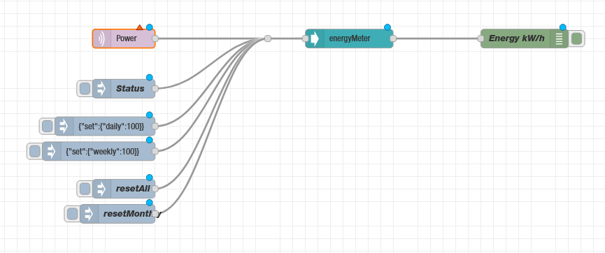
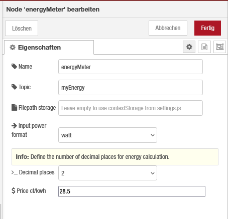

 

[![NPM version][npm-version-image]][npm-url]
[![NPM downloads per month][npm-downloads-month-image]][npm-url]
[![NPM downloads total][npm-downloads-total-image]][npm-url]
[![MIT License][license-image]][license-url]

# Energymeter

**This node calculates energy based on power inputs. No need to measure time seperately.**

As you may use one or more appliance in your home automation which are able to output power measurement you may want to know the energy consumption/production over a specific period of time. This node takes power values as input parameter and calculates the energy amount. As energy can be discribed as the product of power and a time period, the time period this node uses is the intervall between two inputs.

# Highlights

-   &rarr; calculate energy from simple power input
-   &rarr; persistance storage
-   &rarr; various setter functions

> [!IMPORTANT]
> Make sure write access is granted when using file storage.

# Changelog

-   see on github: [changelog](https://github.com/Marcvolta/node-red-energymeter/blob/main/CHANGELOG.md)

# Installation

## In Node-RED (preferred)

-   Via Manage Palette -> Search for "node-red-contrib-simple-energymeter"

## In a shell

Basic installation:

-   go to the Node-RED "userDir" folder, typically `~/.node-red`
-   run `npm install node-red-contrib-simple-energymeter`

## Usage

Simply wire it to a power input device and make use of the output:

**Fig. 1:** Basic usage node _energymeter_

## Properties

### New: add filepath for persistence storage, so data won't be lost on restart

#### For example: /home/youruser/.node-red/energymeter_1.json

**Fig. 2:** Properties node _energymeter_

## Status, set & reset

> [!NOTE] Options are available for: daily, weekly, monthly, yearly

Send a ...

-   `msg.payload = "status" ` to retrieve current data

-   `msg.payload = "resetDaily" ` to reset daily energy value
-   ...
-   `msg.payload = "resetYearly" ` to reset yearly energy value

-   `msg.payload= {"set":{"daily":100}}` to set a daily energy value
-   ...
-   `msg.payload= {"set":{"yearly":100}}` to set a yearly energy value

[npm-version-image]: https://img.shields.io/npm/v/node-red-contrib-simple-energymeter/latest
[npm-downloads-month-image]: https://img.shields.io/npm/dm/node-red-contrib-simple-energymeter
[npm-downloads-total-image]: https://img.shields.io/npm/dt/node-red-contrib-simple-energymeter
[npm-url]: https://npmjs.org/package/node-red-contrib-simple-energymeter
[license-url]: https://github.com/Marcvolta/node-red-energymeter/LICENSE
[license-image]: https://img.shields.io/github/license/Marcvolta/node-red-energymeter
