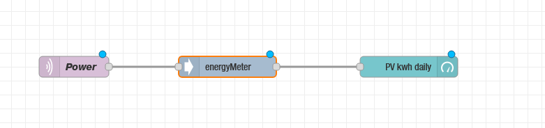
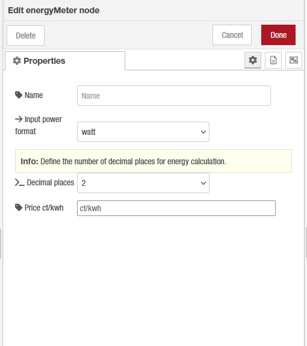

 

[![NPM version][npm-version-image]][npm-url]
[![NPM downloads per month][npm-downloads-month-image]][npm-url]
[![NPM downloads total][npm-downloads-total-image]][npm-url]
[![MIT License][license-image]][license-url]

# Energymeter

**This node calculates energy based on power inputs. No need to measure time seperately.**

As you may use one or more appliance in your home automation which are able to output power measurement you may want to know the energy consumption/production over a specific period of time. This node takes power values as input parameter and calculates the energy amount. As energy can be discribed as the product of power and a time period, the time period this node uses is the intervall between two inputs.

# Installation

## In Node-RED (preferred)

* Via Manage Palette -> Search for "node-red-contrib-energymeter"

## In a shell
Basic installation:
* go to the Node-RED "userDir" folder, typically `~/.node-red`
* run `npm install node-red-contrib-energymeter`

## Usage
Simply wire it with an power input device and make use of the output:

  

**Fig. 1:** Basic usage node *energymeter*

## Properties

  

**Fig. 1:** Properties node *energymeter*

[npm-url]: https://npmjs.org/package/node-red-contrib-energymeter
[license-url]: https://github.com/Marcvolta/node-red-energymeter/LICENSE